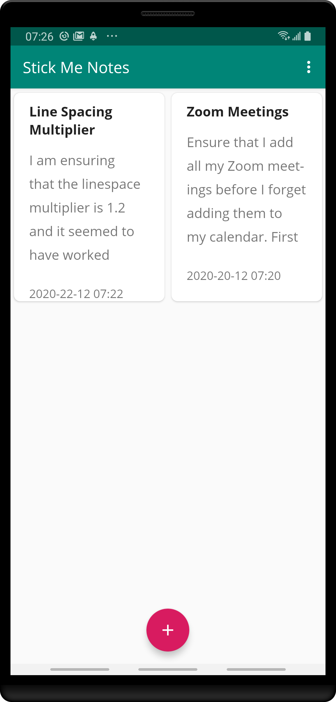
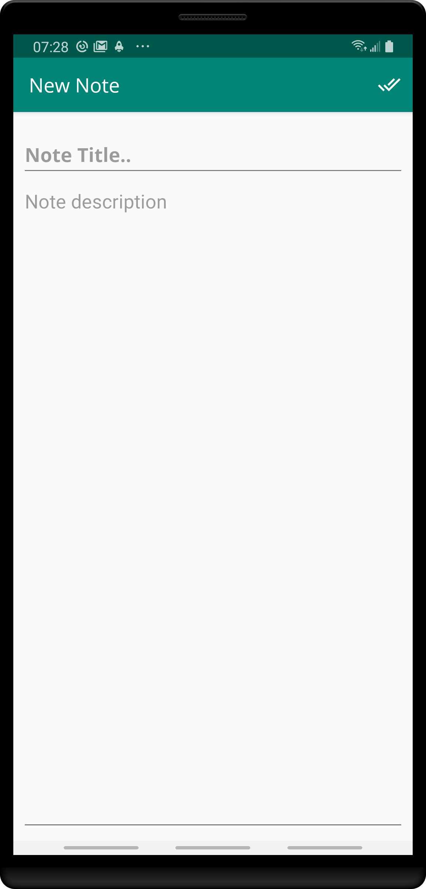

# Stick Me Notes

Stick Me Notes is a sample Android application that has one purpose alone, which is to record notes which include a title, description and the date and time when it was last updated.

## Libraries Used

The main libraries used are

- [Kotlin coroutines](https://kotlinlang.org/docs/reference/coroutines-overview.html)
- [Room library](https://developer.android.com/reference/android/arch/persistence/room/RoomDatabase)
- [LiveData](https://developer.android.com/topic/libraries/architecture/livedata) and [ViewModel](https://developer.android.com/topic/libraries/architecture/viewmodel)

### Purpose of App

The purpose of the app is to demonstrate the **MVVM** pattern and the use of **Kotlin coroutines** in an Android app. Anyone is free to clone the app. I have structured it such that the structure is easy to understand.

## Screens (Activities)

The app so far is composed of two activities which are the MainActivity and NewNoteActivity

|  |  |
| --------------------------------------------- | ------------------------------------------- |
|                                               |                                             |

